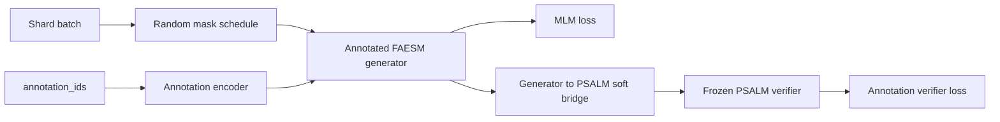

# InversePSALM v1 Architecture

Training receives unmasked sequence token IDs and full PSALM fine annotation IDs
from batch-major shards.

At each step the trainer dynamically masks residue positions and, when
`model.annotation_track` is enabled, sends the masked sequence plus the
annotation track into the generator:

```text
sequence ids -> FAESM embedding stage -> e_x
annotation ids -> configurable annotation encoder -> u_a
h0 = e_x + alpha * u_a
h0 -> FAESM trunk -> pretrained LM head -> amino-acid logits
```

The annotation encoder is selected in `configs/base.yaml`:

- `full_token`: embeds each PSALM fine-label token directly, then projects
  through a ReLU MLP (`640 -> 2560 -> 2560 -> generator_hidden`).
- `factorized`: decodes each fine-label token into `(family_id, state_type)`,
  embeds family and state separately, concatenates them, then uses the same MLP.

Ignored annotation positions (`-100`, used for CLS/EOS/padding) are zeroed after
the encoder projection. Real background residues use the PSALM `None` label
(`0`) and still receive a learned annotation representation.

When `model.annotation_loss` is enabled, the frozen verifier branch keeps the
PSALM role clean:

```text
generator logits -> softmax over generator vocab
soft amino-acid probabilities -> PSALM embedding expectation
expected embeddings -> frozen PSALM backbone -> frozen PSALM fine-state head
```

The training loss is:

```text
loss = mlm_weight * masked_sequence_ce
     + verifier_weight * psalm_fine_annotation_ce  # only when annotation_loss=true
```

The generator trunk and pretrained LM head are frozen by default. Both are
controlled by simple config knobs, with no progressive unfreezing in v1.

## Training And Validation Flow



Validation runs configured modes independently:

- `mlm_15pct`: 15% random-mask sequence loss, perplexity, reconstruction
  accuracy, and token count where MLM is enabled by class.
- `mlm_100pct`: 100% random-mask sequence loss, perplexity, reconstruction
  accuracy, and token count where MLM is enabled by class.
- `design_verifier`: 100% random-mask verifier annotation loss, perplexity,
  accuracy, and token count where annotation loss is enabled by class.

Each mode logs per-class metrics for `original`, `shuffled`, `negative`, and
`domain_slice` where applicable, plus aggregate metrics over contributing tokens.
